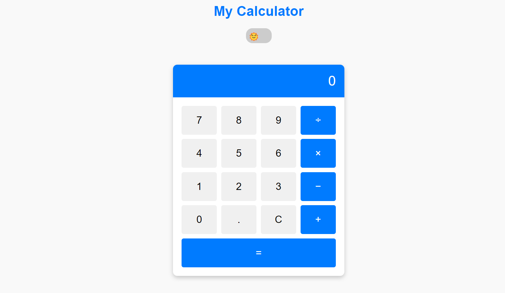
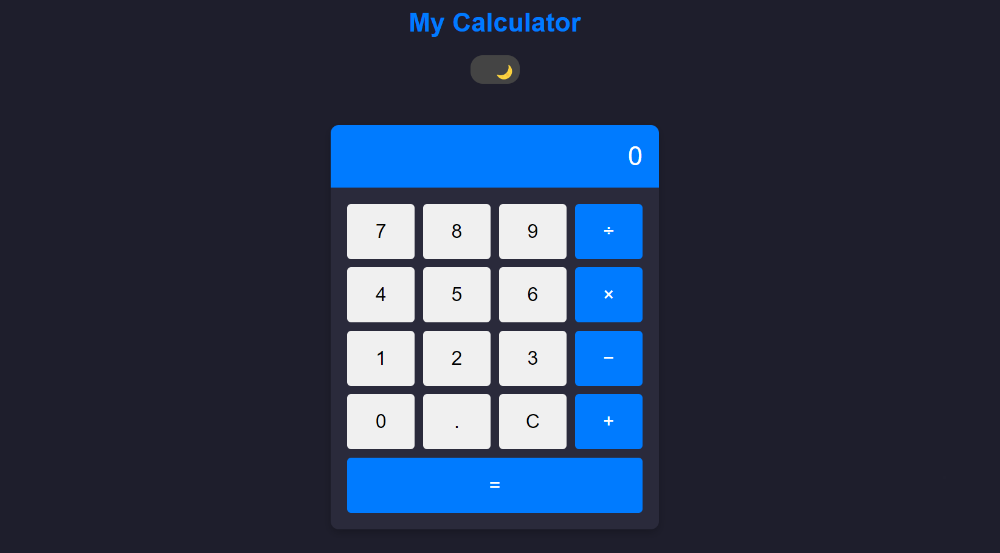

# **Calculator Web Application**

## **Description**  
This is a fully functional and interactive **Calculator Web Application** built using **HTML**, **CSS**, and **JavaScript**. The application provides a user-friendly interface for performing basic arithmetic operations. It also features light and dark themes, enhancing the user experience.

**Live Demo**: [Calculator Web Application](https://sithala-sai-vamshi.github.io/Calculator-Online-Web-Application/)

## **Key Features**  
- **Basic Arithmetic Operations**: Supports addition, subtraction, multiplication, and division.  
- **Responsive Layout**: Optimized for both desktop and mobile devices.  
- **Interactive Design**: Buttons visually respond to user actions, providing an engaging experience.  
- **Keyboard Support**: Users can interact with the calculator using their keyboard for efficiency.  
- **Dynamic Display**: Real-time updates to the display as users perform operations.  
- **Light and Dark Modes**: Toggle between light and dark themes for better usability in different lighting conditions.

## **Technical Skills Demonstrated**
- **HTML**: Structured the layout of the calculator and included semantic tags for accessibility.  
- **CSS**: Styled the application with a modern look, including grid-based button layouts and hover effects.  
- **JavaScript**: Implemented core functionality like number input, arithmetic logic, and display updates.

## **Preview**
### **Light Mode**


### **Dark Mode**


## **How to Use**
1. Clone the repository to your local system:  
   ```bash
   git clone https://github.com/yourusername/calculator-web-app.git
